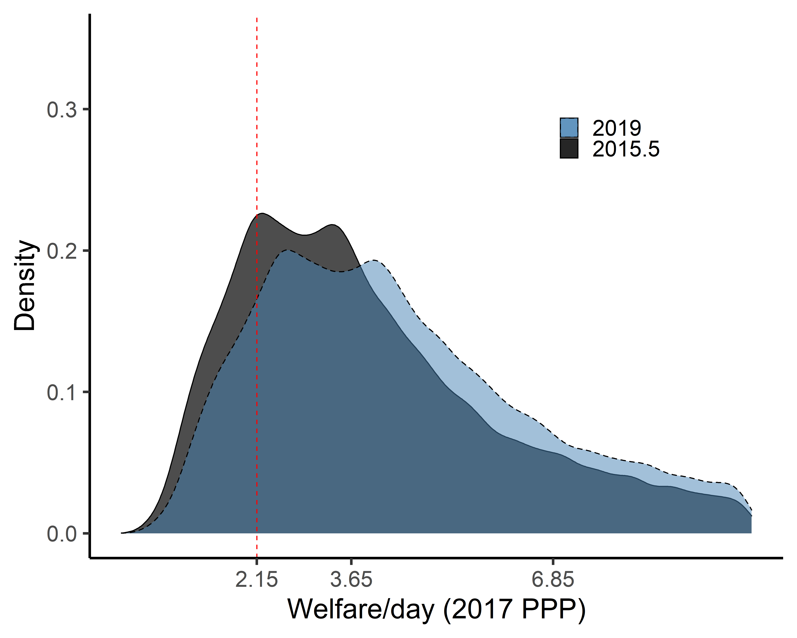

# Calculating global and regional estimates {#lineupestimates}

Few countries have survey estimates of poverty available every year. To estimate poverty at the regional and global level, the survey estimates need to be aligned to a reference year and aggregated. Such alignment and aggregation require assumptions about how to interpolate and extrapolate data as well as how to treat countries without any household survey data at all. This section explains how these calculations are made. Source code can be found [here](https://github.com/PIP-Technical-Team/wbpip/blob/master/R/predict_request_year_mean.R) and [here](https://github.com/PIP-Technical-Team/wbpip/blob/master/R/fill_gaps.R).

## Extrapolations {#extrapolations}

For countries that do not have welfare aggregates at or since a specific reference year, but which do have earlier welfare aggregates available, their most recent aggregate is extrapolated forward using growth rates from national accounts. This is done by first finding the growth in national accounts that occurred between the survey and the reference year and scaling the survey welfare distribution, $f(y_{survey})$, by this growth factor. This yields an estimate of the welfare distribution at the reference year, $f(y_{reference})$ as summarized below:

$$f(y_{reference}) = \dfrac{NA_{reference}}{NA_{survey}} \times f(y_{survey})$$

where $NA_{t}$ is real GDP per capita or real HFCE per capita at time $t$, as explained in the [national accounts data section](#nationalaccounts). Poverty for the reference year is then estimated using this extrapolated distribution. A similar approach is used to extrapolate backwards, when the earliest survey estimate available is more recent than the desired reference year. The extrapolation method assumes distribution-neutral growth, i.e. that everyone's welfare grows at the same rate. This implies that inequality is assumed to stay constant.

The below example charts the consumption aggregate from the 2015.5 Ethiopian survey expressed in 2017 PPP-adjusted dollars, and the 2018 Ethiopian distribution one would get from extrapolating this welfare vector to 2018 using the method described above. The 2015.5 daily consumption mean is 3.12 and the growth rate in national accounts between 2015.5 and 2018 is 14.5%. Note that the positive growth pushes the distribution to the right. This changes the share of extreme poor -- those living below the \$2.15 poverty line -- from 30.8% in 2015.5 to 22.3% in 2018.

When household surveys span two calendar years, as the example above, the national accounts data used for extrapolating this survey forward is the weighted average of the two years, with the weights determined by the share of the fieldwork that took place in each year (see the end of the section \@ref(selection) for details).

## Interpolations {#interpolations}

In cases where the reference year falls between two surveys, poverty is interpolated for the reference year using the nearest survey on each side of the reference year. One of two approaches are used, depending on the correspondence in growth between national accounts and survey data.

"Same direction" interpolation is used when growth in the survey mean between the two surveys is of the same sign as (1) the growth in national accounts from the first survey to the reference year, and (2) from the reference year to the second survey. Denoting $survey1$ the survey predating the reference year and $survey2$ the survey after the reference year, this means that same direction interpolation is used when

$$sign \bigg(\dfrac{μ_{survey2}}{μ_{survey1}}-1\bigg) = 
  sign \bigg(\dfrac{NA_{survey2}}{NA_{reference}}-1\bigg) = 
  sign \bigg(\dfrac{NA_{reference}}{NA_{survey1}}-1\bigg)$$

"Diverging directions" interpolation is used when the equation above does not hold. The main difference between the two is that "same direction" interpolation tries to estimate how much of the growth in national accounts that had accrued at the reference year, and uses this to back out a predicted survey mean at the reference year. When the survey mean and national accounts grow in opposite directions this is not meaningful, and an alternative approach is used.

Interpolations are never done between consumption and income aggregates. Whenever both are available, [specific rules are used to determine which aggregate to use](#inccon).

### "Same direction" interpolation

"Same direction" interpolation works in three steps.

First, the survey mean at the reference year, $μ_{reference}$, is estimated using the following interpolation formula:

$$μ_{reference} = (μ_{survey2} - μ_{survey1}) \times \dfrac{NA_{reference} - NA_{survey1}}{NA_{survey2} - NA_{survey1}} + μ_{survey1}$$

Second, the welfare distributions at the two surveys are scaled to reflect this mean:

$$f(y_{reference,i}) = \dfrac{μ_{reference}}{μ_{survey,i}} \times f(y_{survey,i}), $$where $i={1,2}$ . After this alignment, there will be two distributions with the same mean for the reference year but with different distributional shapes.

At the third step, poverty is estimated from each of these distributions, and the final poverty estimate at the reference year is the weighted average poverty rate from both distributions where each poverty estimate is weighted by the inverse of the relative distance between the survey year and the reference year:

$$P_{0,reference} = \dfrac{P_{0,reference,1}*(t_{survey,2}-t_{reference})+P_{0,reference,2}*(t_{reference}-t_{survey,1})}{t_{survey,2}-t_{survey,1}} $$For example, if a reference year falls two years after the first survey and one year before the second survey, the poverty estimate from the first survey is given a weight of 1/3 and the estimate from the second survey a weight of 2/3.

### "Diverging directions" interpolation

If the growth rates in surveys and national accounts diverge, an approach similar to the extrapolation is applied to the two closest surveys; poverty is extrapolated forward by the national account growth rate using the early survey and backwards using the later survey. Poverty for the reference year is estimated using both distributions and the estimates are averaged using the formula above.

The mechanics of the extrapolation and interpolation are described in @ravallion2003, @chen2004, box 6.4 in @jolliffe2015, and in Appendix A of @worldbank2018.

## National accounts data {#nationalaccounts}

All of the interpolation and extrapolation methods described above rely on national accounts data. Two national accounts variables are used: Household Final Consumption Expenditure (HFCE) and Gross Domestic Product (GDP) -- both in real per capita terms. Due to its close conceptual relation with the welfare aggregate, when available, HFCE is used as the preferred national accounts data for extrapolation and interpolation methods. In Sub-Saharan Africa, however, HFCE estimates at constant prices are both sparse and the empirical correlation between growth in HFCE and growth in the survey mean is not as strong [@ravallion2003]. Hence, GDP is preferred for this region. The [World Development Indicators](https://databank.worldbank.org/source/world-development-indicators) (WDI) database is the primary source for the HFCE data (we use the [Households Final Consumption Expenditure per capita (constant 2010 US\$)](https://data.worldbank.org/indicator/NE.CON.PRVT.PC.KD) series with the series code NE.CON.PRVT.PC.KD) and the GDP data (where we use the [GDP per capita (constant 2010 US\$)](https://data.worldbank.org/indicator/NY.GDP.PCAP.KD) series with the series code NY.GDP.PCAP.KD).

For a handful of countries, the data in WDI do not reflect calendar-year estimates but country-specific fiscal-year estimates. In those cases, the WDI data are converted to calendar-year estimates (see @castanedaaguilar2022). When WDI data are not available, we use data from the [World Economic Outlook](https://www.imf.org/en/Publications/WEO) and the [Maddison Project Database](https://www.rug.nl/ggdc/historicaldevelopment/maddison/?lang=en). For a detailed discussion on the sources of national accounts data see [@prydz2019].

It is important to note that the extrapolations and interpolations use only the growth rate from national accounts. In many countries, important differences in income levels between surveys and national accounts also exist [@jolliffe]. Since the growth rate is the same whether PPPs or USD are used, it is immaterial that the constant USD series is used in the extrapolations and interpolations, while the survey welfare aggregate is expressed in PPPs.

## Choosing between consumption and income estimates {#inccon}

The discussion on interpolation and extrapolation for simplicity assumed that only one welfare aggregate was available for a given country at a given year. Yet, a number of countries have poverty estimates available from both [consumption and income aggregates](#incomeorconsumption). Due to its closer connection to welfare, whenever both income and consumption estimates are available for a given reference year, consumption estimates are preferred. Likewise, when both kinds of poverty estimates are available for the same years (but not for a particular reference year), interpolations and extrapolation are made using the consumption estimates. When consumption and income estimates are available at different years, the choice is a bit more complicated. The precise rules are outlined in the following decision tree:

## Regional classification {#regionsandcountries}

In total, 218 economies are included in the global poverty estimates. The entire universe of economies considered corresponds to the universe of economies in the [World Bank's Country and Lending Groups](https://datahelpdesk.worldbank.org/knowledgebase/articles/906519-world-bank-country-and-lending-groups). The regions employed in PIP, however, differ from the regional classifications used by the World Bank. Some economies, mostly high-income economies, are excluded from the geographical regions and are included as a separate group referred to as "other high income" (or "industrialized economies" or "rest of the world" in earlier publications). The list of economies included in each region is as follows:

-   **East Asia and Pacific:** American Samoa; Cambodia; China; Fiji; Indonesia; Kiribati; Korea, Democratic People's Republic of; Lao People's Democratic Republic; Malaysia; Marshall Islands; Micronesia, Federated States of; Mongolia; Myanmar; Northern Mariana Islands; Palau; Papua New Guinea; Philippines; Samoa; Solomon Islands; Thailand; Timor-Leste; Tonga; Tuvalu; Vanuatu; Vietnam.

-   **Europe and Central Asia:** Albania; Armenia; Azerbaijan; Belarus; Bosnia and Herzegovina; Bulgaria; Croatia; Czech Republic; Estonia; Georgia; Hungary; Kazakhstan; Kosovo; Kyrgyz Republic; Latvia; Lithuania; Moldova; Montenegro; North Macedonia; Poland; Romania; Russian Federation; Serbia; Slovak Republic; Slovenia; Tajikistan; Ukraine; Uzbekistan.

-   **Latin America and the Caribbean:** Argentina; Barbados; Belize; Bolivia; Brazil; Chile; Colombia; Costa Rica; Cuba; Dominica; Dominican Republic; Ecuador; El Salvador; Grenada; Guatemala; Guyana; Haiti; Honduras; Jamaica; Mexico; Nicaragua; Panama; Paraguay; Peru; St. Kitts and Nevis; St. Lucia; St. Vincent and the Grenadines; Suriname; Trinidad and Tobago; Uruguay; Venezuela, Republica Bolivariana de.

-   **Middle East and North Africa:** Algeria; Djibouti; Egypt, Arab Republic of; Iran, Islamic Republic of; Iraq; Jordan; Lebanon; Libya; Morocco; Oman; Syrian Arab Republic; Tunisia; West Bank and Gaza; Yemen, Republic of.

-   **Other High Income (at times referred to as "Rest of the World"):** Andorra; Antigua and Barbuda; Aruba; Australia; Austria; Bahamas, the; Bahrain; Belgium; Bermuda; British Virgin Islands; Brunei Darussalam; Canada; Cayman Islands; Channel Islands; Curacao; Cyprus; Denmark; Faroe Islands; Finland; France; French Polynesia; Germany; Gibraltar; Greece; Greenland; Guam; Hong Kong SAR, China; Iceland; Ireland; Isle of Man; Israel; Italy; Japan; Korea, Republic of; Kuwait; Liechtenstein; Macao SAR, China; Malta; Monaco; Nauru; Netherlands; New Caledonia; New Zealand; Norway; Portugal; Puerto Rico; Qatar; San Marino; Saudi Arabia; Singapore; Sint Maarten; Spain; St. Martin; Sweden; Switzerland; Taiwan, China; Turks and Caicos Islands; United Arab Emirates; United Kingdom; United States; Virgin Islands, US.

-   **South Asia:** Afghanistan; Bangladesh; Bhutan; India; Maldives; Nepal; Pakistan; Sri Lanka

-   **Sub-Saharan Africa:** Angola; Benin; Botswana; Burkina Faso; Burundi; Cabo Verde; Cameroon; Central African Republic; Chad; Comoros; Congo, Democratic Republic of; Congo, Republic of; Cote d'Ivoire; Equatorial Guinea; Eritrea; Eswatini; Ethiopia; Gabon; Gambia, the; Ghana; Guinea; Guinea-Bissau; Kenya; Lesotho; Liberia; Madagascar; Malawi; Mali; Mauritania; Mauritius; Mozambique; Namibia; Niger; Nigeria; Rwanda; Sao Tome and Principe; Senegal; Seychelles; Sierra Leone; Somalia; South Africa; South Sudan; Sudan; Tanzania; Togo; Uganda; Zambia; Zimbabwe.

## Population {#population}

To derive regional and global poverty rates, each country's poverty rate is weighted using its population share. Population data are taken from the World Bank's [World Development Indicators](http://datatopics.worldbank.org/world-development-indicators/) (WDI). For Kuwait and West Bank and Gaza, population data is missing in the WDI for some years. In those cases, alternative sources are used as outlined in @arayavechkit2021.

The regional and global population may differ from the aggregates given in the World Development Indicators, because PIP uses different regional compositions of economies (See [Regional classification section](#regionsandcountries)).

## Treatment of countries without any poverty data {#nodata}

With the [interpolation](#interpolations) and [extrapolation](#extrapolations) rules, all economies with at least one data point will have poverty estimates available for all years (conditional on [national accounts data](#nationalaccounts) being present). Yet some economies have no household survey data that can be used to monitor poverty (or they lack credible [PPPs](#PPPs) or [CPIs](#CPIs) necessary to compute international poverty). In order to include these economies in the regional and global poverty estimates, it is assumed that they have a poverty headcount equal to their [region's](#regionsandcountries) population-weighted average.

## Coverage rule {#coverage}

Though the [interpolation](#interpolations) rules, [extrapolation](#extrapolations) rule, and [treatment of countries without any data](#nodata) assures that *some* poverty estimate is available for all regions and the world as a whole since 1981, the confidence one can have in these estimates depends on the how often and how long one has to extrapolate or interpolate the data, as well as the share of the population without any data at all.

To avoid presenting regional and global numbers based on outdated or no data, coverage rules are used to determine whether a particular reference year has sufficient data coverage. A country is considered to have sufficiently recent data if it has a survey-based poverty estimate at most three years from the reference year. Regional estimates are displayed for a given year if data cover 50 percent of the population in the region. For regions in which the surveys within three years either side of the reference year account for less than half of the regional population, the regional poverty estimate is not reported.

An additional coverage requirement is applied to govern when global poverty estimates are reported for a given reference year. This requirement addresses the goal of focusing the measurement of global poverty on economies where most of the poor live. Specifically, it tries to avoid a situation in which the global population threshold is met by having recent data in high-income countries, East Asia & Pacific, and Latin America & the Caribbean, which together account for a small share of the global extreme poor. Under this requirement, global poverty estimates are reported only if data are representative of at least 50 percent of the population in low-income and lower-middle-income countries, because most of the poor live in these groups of countries. [The World Bank classification of economies according to income groups](https://datahelpdesk.worldbank.org/knowledgebase/articles/906519-world-bank-country-and-lending-groups) in the reference year is used. This requirement is only applied to the global poverty estimate, not to regional estimates (for more details see @castanedaaguilar2020).
