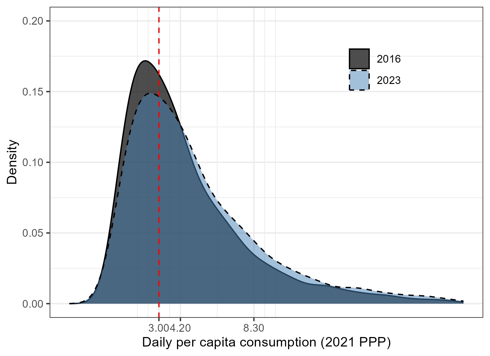

# Calculating global and regional estimates {#lineupestimates}

Few countries have survey estimates of poverty available every year. To estimate poverty at the regional and global level, the survey estimates need to be aligned to a reference year and aggregated. Such alignment and aggregation require assumptions about how to interpolate and extrapolate data as well as how to treat countries without any household survey data at all. This section explains how these calculations are made. Source code can be found [here](https://github.com/PIP-Technical-Team/wbpip/blob/master/R/predict_request_year_mean.R) and [here](https://github.com/PIP-Technical-Team/wbpip/blob/master/R/fill_gaps.R).

## Extrapolations {#extrapolations}

For countries that do not have welfare aggregates at a specific reference year, but which do have earlier welfare aggregates available, their most recent aggregate is extrapolated forward using growth rates from national accounts, either real GDP per capita or real Household Final Consumption Expenditure (HFCE) per capita. Only a fraction of growth is passed through to the survey welfare aggregate based on evidence suggesting a misalignment between growth in survey means and national accounts [@ravallion2003; @prydz2022]. PIP uses a passthrough rate of 0.7 for consumption aggregates and 1 (meaning full passthrough) for income aggregates. The selection of a 0.7 passthrough rate, and the decision to only apply this to countries that use a consumption aggregate is based on empirical evidence from @mahler2022. The extrapolation is implemented by first finding the growth in national accounts, $g^{NA}_{s,s+1}$, between the survey year, $s$, and the following year, $s+1$, and scaling the survey welfare distribution, $\mathbf{y_{s}}$, by (a fraction of) this factor. This is continued year-by-year until the reference year of interest, $r$, is reached. Concretely, this means that the extrapolated welfare distribution, $\mathbf{y_{r}}$, is given by:

$$\mathbf{y_r} = \mathbf{y_{s}}*\prod_{t=s}^{r-1}{(1+passthrough*g^{NA}_{t,t+1})}$$

where $g^{NA}_{t,t+1}$ is growth real GDP per capita or real HFCE per capita as explained in the [national accounts data section](#nationalaccounts), and $passthrough$ equals $0.7$ or $1$. Poverty for the reference year is then estimated using this extrapolated distribution. A similar approach is used to extrapolate backwards, when the earliest survey estimate available is more recent than the desired reference year. The extrapolation method assumes distribution-neutral growth, i.e. that everyone's welfare grows at the same rate. This implies that inequality is assumed to stay constant.

The example below illustrates the consumption distribution from the 2016 Ghanaian survey expressed in 2021 PPP-adjusted dollars, and the 2023 Ghanaian distribution when extrapolating this welfare vector to 2023 using the method described above. The 2016 daily consumption mean is $\$4.91$ and the growth rate in real GDP per capita between 2016 and 2023 is $14\%$. The positive growth rate pushes the extrapolated distribution to the right, representing increased consumption levels, causing the share of extreme poor -- those living below the $\$3.00$ poverty line -- to decrease from $40.5\%$ in 2016 to $34.5\%$ in 2023.

When household surveys span two calendar years, the national accounts data used for extrapolation thes survey forward is the weighted average of the two years. The weights of the national accounts data is determined by the share of the fieldwork that took place in each year (see the end of the section \@ref(selection) for details).

## Interpolations {#interpolations}

In cases where the reference year falls between two surveys, poverty is interpolated for the reference year using the nearest survey on each side of the reference year. One of two approaches are used depending on the correspondence in growth between national accounts and survey data.

Denoting $s_1$ the survey predating the reference year and $s_2$ the survey after the reference year, "same direction" interpolation is used when growth in the survey mean, $g^\mu_{s_1,s_2}$, between the two surveys is of the same sign as (1) the growth in national accounts from the first survey to the reference year, $g^{NA}_{s_1,r}$ and (2) from the reference year to the second survey, $g^{NA}_{r,s_2}$. This means that same direction interpolation is used when

$$sign (g^{\mu}_{s_1,s_2}) = sign (g^{NA}_{s_1,r}) = 
  sign (g^{NA}_{r,s_2})$$

"Diverging directions" interpolation is used when the equation above does not hold. The main difference between the two is that "same direction" interpolation estimates how much of the growth in national accounts that had accrued at the reference year, and uses this to back out a predicted survey mean at the reference year. When the survey mean and national accounts grow in opposite directions this is not meaningful, and an alternative approach is used.

Interpolations are never done between consumption and income aggregates. Whenever both are available, [specific rules are used to determine which aggregate to use](#inccon).

### "Same direction" interpolation

"Same direction" interpolation works in three steps. First, the survey mean at the reference year, $μ_{r}$, is estimated using the following interpolation formula:

$$μ_{r} = (μ_{s_2} - μ_{s_1}) \times \dfrac{\prod_{t=s_1}^{r-1}{(1+passthrough*g^{NA}_{t,t+1})}-1}{\prod_{t=s_1}^{s_2-1}{(1+passthrough*g^{NA}_{t,t+1})}-1} + μ_{s_1}$$

Second, the welfare distributions at the two surveys are scaled to reflect this mean:

$$\mathbf{y_{r_1}} = \dfrac{μ_{r}}{μ_{s_1}} \times \mathbf{y_{s_1}}, \hspace{5mm} \mathbf{y_{r_2}} = \dfrac{μ_{r}}{μ_{s_2}} \times \mathbf{y_{s_2}}$$

After this alignment, there will be two distributions with the same mean for the reference year but with different distributional shapes.

At the third step, poverty is estimated from each of these distributions, and the final poverty estimate at the reference year is the weighted average poverty rate from both distributions where each poverty estimate is weighted by the inverse of the relative distance between the survey year and the reference year:

$$P_{0,r} = \dfrac{P_{0,r_1}*(t_{s_2}-t_{r})+P_{0,r_2}*(t_{r}-t_{s_1})}{t_{s_2}-t_{s_1}} $$For example, if a reference year falls two years after the first survey and one year before the second survey, the poverty estimate from the first survey is given a weight of $1/3$ and the estimate from the second survey a weight of $2/3$.

### "Diverging directions" interpolation

If the growth rates in surveys and national accounts diverge, an approach similar to the extrapolation is applied to the two closest surveys; poverty is extrapolated forward by (a fraction of) the national account growth rate using the early survey and backwards using the later survey. Poverty for the reference year is estimated using both distributions and the estimates are averaged using the formula above.

The mechanics of the extrapolation and interpolation (without accounting for passthrough rates) are described in @ravallion2003, @chen2004, box 6.4 in @jolliffe2015, and in Appendix A of @worldbank2018.

## National accounts data {#nationalaccounts}

All of the interpolation and extrapolation methods described above rely on national accounts data. Two national accounts variables are used: Household Final Consumption Expenditure (HFCE) and Gross Domestic Product (GDP) -- both in real per capita terms. Due to its close conceptual relation with the welfare aggregate, when available, HFCE is used as the preferred national accounts data for extrapolation and interpolation methods. In low- and lower-middle-income countries, however, growth in HFCE is a worse predictor of growth in welfare than growth in GDP, likely because HFCE is calculated as the residual component of GDP in countries with low statistical capacity. Hence, GDP is preferred in these cases [@mahler2024]. The [World Development Indicators](https://databank.worldbank.org/source/world-development-indicators) (WDI) database is the primary source for the HFCE data (we use the [Households and NPISHs Final Consumption Expenditure per capita (constant 2015 US\$)](https://data.worldbank.org/indicator/NE.CON.PRVT.PC.KD) series with the series code NE.CON.PRVT.PC.KD) and the GDP data (where we use the [GDP per capita (constant 2015 US\$)](https://data.worldbank.org/indicator/NY.GDP.PCAP.KD) series with the series code NY.GDP.PCAP.KD). The only exception to this is the interpolation done for Syria from 2009-2022, which relies on nominal GDP per capita deflated with the CPI. This exception is carried out due to quality concerns with the GDP deflator [@castanedaaguilar2024].

For a handful of countries, the data in WDI do not reflect calendar-year estimates but country-specific fiscal-year estimates. In those cases, the WDI data are converted to calendar-year estimates (see @castanedaaguilar2022). When WDI data are not available, we use data from the [World Economic Outlook](https://www.imf.org/en/Publications/WEO) and the [Maddison Project Database](https://www.rug.nl/ggdc/historicaldevelopment/maddison/?lang=en). For a detailed discussion on the sources of national accounts data see [@prydz2019].

The extrapolations and interpolations use only the growth rate from national accounts. In many countries, important differences in income levels between surveys and national accounts also exist [@prydz2022]. Since the growth rate is the same whether PPPs or USD are used, it is immaterial that the constant USD series is used in the extrapolations and interpolations, while the survey welfare aggregate is expressed in PPPs.

## Choosing between consumption and income estimates {#inccon}

The discussion on interpolation and extrapolation for simplicity assumed that only one welfare aggregate was available for a given country at a given year. Yet, a number of countries have poverty estimates available from both [consumption and income aggregates](#incomeorconsumption). Due to its closer connection to welfare, whenever both income and consumption estimates are available for a given reference year, consumption estimates are preferred. Likewise, when both kinds of poverty estimates are available for the same years (but not for a particular reference year), interpolations and extrapolation are made using the consumption estimates. When consumption and income estimates are available at different years, the choice is a bit more complicated. The precise rules are outlined in the following decision tree:

{width="1500"}

## Nowcasts

PIP includes nowcasts of poverty, that is, poverty estimates for the year in question. Two types of nowcasts are available, referred to as the *global model* estimates and *local model* estimates. The *global model* poverty nowcasts follow the method described in the [extrapolation session](#extrapolations). The national accounts data for the nowcasts are not available in the WDI, and are instead taken from the World Bank's Macro Poverty Outlook or Global Economic Prospects, supplemented with GDP nowcasts from IMFs' World Economic Outlook where necessary. These nowcasts are available through the API or through [pip.worldbank.org/nowcasts](https://pip.worldbank.org/nowcasts). The *local model* poverty nowcasts use country-specific methods by World Bank experts on poverty in a country. The source of these estimates is the Macro & Poverty Outlook and are the preferred country nowcasts. These estimates are available through [pip.worldbank.org/nowcasts](https://pip.worldbank.org/nowcasts), where the specific method used for each country is also described.

## Regional classification {#regionsandcountries}

In total, 218 economies are included in the global poverty estimates. The entire universe of economies considered corresponds to the universe of economies in the [World Bank's Country and Lending Groups](https://datahelpdesk.worldbank.org/knowledgebase/articles/906519-world-bank-country-and-lending-groups). The list of economies included in each region is as follows:

-   **East Asia and Pacific:** American Samoa; Australia; Brunei Darussalam; Cambodia; China; Fiji; French Polynesia; Guam; Hong Kong SAR, China; Indonesia; Japan; Kiribati; Korea, Dem. Rep.; Korea, Rep.; Lao PDR; Macao SAR, China; Malaysia; Marshall Islands; Micronesia, Fed. Sts.; Mongolia; Myanmar; Nauru; New Caledonia; New Zealand; Northern Mariana Islands; Palau; Papua New Guinea; Philippines; Samoa; Singapore; Solomon Islands; Taiwan, China; Thailand; Timor-Leste; Tonga; Tuvalu; Vanuatu; Viet Nam.

-   **Europe and Central Asia:** Albania; Andorra; Armenia; Austria; Azerbaijan; Belarus; Belgium; Bosnia and Herzegovina; Bulgaria; Channel Islands; Croatia; Cyprus; Czechia; Denmark; Estonia; Faeroe Islands; Finland; France; Georgia; Germany; Gibraltar; Greece; Greenland; Hungary; Iceland; Ireland; Isle of Man; Italy; Kazakhstan; Kosovo; Kyrgyz Republic; Latvia; Liechtenstein; Lithuania; Luxembourg; Moldova; Monaco; Montenegro; Netherlands; North Macedonia; Norway; Poland; Portugal; Romania; Russian Federation; San Marino; Serbia; Slovak Republic; Slovenia; Spain; Sweden; Switzerland; Tajikistan; Turkmenistan; Türkiye; Ukraine; United Kingdom; Uzbekistan.

-   **Latin America and the Caribbean:** Antigua and Barbuda; Argentina; Aruba; Bahamas, The; Barbados; Belize; Bolivia; Brazil; British Virgin Islands; Cayman Islands; Chile; Colombia; Costa Rica; Cuba; Curaçao; Dominica; Dominican Republic; Ecuador; El Salvador; Grenada; Guatemala; Guyana; Haiti; Honduras; Jamaica; Mexico; Nicaragua; Panama; Paraguay; Peru; Puerto Rico (U.S.); Sint Maarten (Dutch part); St. Kitts and Nevis; St. Lucia; St. Martin (French part); St. Vincent and the Grenadines; Suriname; Trinidad and Tobago; Turks and Caicos Islands; Uruguay; Venezuela, RB; Virgin Islands (U.S.).

-   **Middle East, North Africa, Afghanistan and Pakistan:** Lebanon; Libya; Malta; Morocco; Oman; Pakistan; Qatar; Saudi Arabia; Syrian Arab Republic; Tunisia; United Arab Emirates; West Bank and Gaza; Yemen, Rep.

-   **North America:** Bermuda; Canada; United States.

-   **South Asia:** Bangladesh; Bhutan; India; Maldives; Nepal; Sri Lanka.

-   **Sub-Saharan Africa:** Angola; Benin; Botswana; Burkina Faso; Burundi; Cabo Verde; Cameroon; Central African Republic; Chad; Comoros; Congo, Dem. Rep.; Congo, Rep.; Côte d'Ivoire; Equatorial Guinea; Eritrea; Eswatini; Ethiopia; Gabon; Gambia, The; Ghana; Guinea; Guinea-Bissau; Kenya; Lesotho; Liberia; Madagascar; Malawi; Mali; Mauritania; Mauritius; Mozambique; Namibia; Niger; Nigeria; Rwanda; Senegal; Seychelles; Sierra Leone; Somalia; South Africa; South Sudan; Sudan; São Tomé and Príncipe; Tanzania; Togo; Uganda; Zambia; Zimbabwe.

## Population {#population}

To derive regional and global poverty rates, each country's poverty rate is weighted using its population share. Population data are taken from the World Bank's [World Development Indicators](http://datatopics.worldbank.org/world-development-indicators/) (WDI). For Kuwait and West Bank and Gaza, population data is missing in the WDI for some years. In those cases, alternative sources are used as outlined in @arayavechkit2021.

The regional and global population may differ from the aggregates given in the World Development Indicators, because PIP uses different regional compositions of economies (See [Regional classification section](#regionsandcountries)).

## Treatment of countries without any poverty data {#nodata}

With the [interpolation](#interpolations) and [extrapolation](#extrapolations) rules, all economies with at least one welfare vector in PIP will have poverty estimates available for all years as long as [national accounts data](#nationalaccounts) are available. Yet, if an economy falls under any of the following three conditions, it is not possible to calculate interpolated and extrapolated poverty estimates:

1.  The economy entirely lacks household data that can be used to monitor poverty.
2.  The economy does not have credible [PPPs](#PPPs) necessary to convert welfare vectors to cross-country comparable currencies.
3.  The economy is missing GDP data for a subset of years necessary to extrapolate and interpolate survey estimates.

If either of the first two conditions apply, the economy will be missing for all years, while if only the last condition applies, the economy will be missing in the years where GDP data is missing. In these country-year combinations, for the purpose of calculating regional and global poverty estimates, PIP applies an imputation approach developed in @mahler2025. The approach uses a handful of variables that are available in all (or nearly all) economies to predict full welfare distributions. Four models are used depending on whether GDP per capita data is available and depending on whether welfare should be predicted in 2021 PPPs or 2017 PPPs. The model where GDP per capita is available is referred to as Tier 1 while the model where GDP per capita is not available is referred to as Tier 2. Welfare, $y_{c,t}$ for country $c$ and year $t$ is predicted as follows:

$$ln⁡(y_{c,t})=\mathbf{X_{c,t}β_X}+ln⁡(\frac{p}{1-p})\mathbf{Z_{c,t}β_Z}$$ Here $\mathbf{X}$ and $\mathbf{Z}$ are vectors of variables predictive of welfare and $\mathbf{β_X}$ and $\mathbf{β_Z}$ are vectors of corresponding coefficients, both shown in the table below. $p$ is a quantile on the distribution going from 0-1. 10,000 points using values of $p$ equally spaced between 0 and 1 are used to generate a full distribution of welfare $y_{c,t}$.

Table : Coefficients estimated to predict full distributions for missing countries

| Outcome variable: Log welfare, $ln(y)$        | 2021 PPPs     |                 | 2017 PPPs     |                 |
|-------------------|--------------|--------------|--------------|--------------|
|                                               | Tier 1        | Tier 2          | Tier 1        | Tier 2          |
|                                               | GDP available | GDP unavailable | GDP available | GDP unavailable |
| $\mathbf{X}$                                  |               |                 |               |                 |
| Intercept                                     | -2.2640       | 1.6046          | -2.5147       | 1.4189          |
| Log GDP per capita (2021 or 2017 PPP)         | 0.4316        |                 | 0.4915        |                 |
| Log under-5 mortality (per 1,000 live births) | -0.1532       | -0.2566         | -0.1645       | -0.2323         |
| Life expectancy (years)                       | 0.0142        | 0.0197          | 0.0090        | 0.0190          |
| Rural population share (0-100)                | -0.0027       | -0.0077         | -0.0013       | -0.0078         |
| Income group                                  |               |                 |               |                 |
| Low income                                    |               | Base            |               | Base            |
| Lower-middle income                           |               | 0.2219          |               | 0.2090          |
| Upper-middle income                           |               | 0.4486          |               | 0.5520          |
| High income                                   |               | 1.1389          |               | 1.2483          |
| Welfare type (income=1, consumption=0)        | -4.1402       |                 | -4.4971       |                 |
| Welfare type \* log GDP per capita            | 0.4328        |                 | 0.4708        |                 |
| $\mathbf{Z}$                                  |               |                 |               |                 |
| Intercept                                     | 0.3465        | 0.3453          | 0.3719        | 0.3181          |
| I[Europe & Central Asia]                      | -0.0264       | -0.0229         | -0.0574       | -0.0037         |
| I[Latin America & Caribbean}                  | 0.1482        | 0.1526          | 0.1232        | 0.1752          |
| I[Sub-Saharan Africa]                         | 0.0609        | 0.0665          | 0.0246        | 0.0683          |

The output from the table can be used to directly predict poverty rates if one isolates p, which can then be interpreted as a poverty rate, and y is interpreted as the corresponding poverty line, as per the following equation:

$$p_{c,t}=\bigg[1+\Big(\frac{\mathbf{exp⁡(X_{c,t}β_X)}}{y}\Big)^{\frac{1}{\mathbf{Z_{c,t}β_Z}}}\bigg]^{-1}$$

Suppose we want to predict the poverty rate at the \$8.30 line in Libya (a missing country in PIP) in 2024. GDP per capita in 2021 PPPs is available, so we can use the Tier 1 model. GDP per capita in 2021 PPPs is \$12,276, under-5 mortality is 14.8 per 1,000 live births, life expectancy at birth is 71.1 years, and the rural population share is 18.1. To predict a consumption-based poverty rate, we first evaluate the following equation:

$${X_{c,t}β_X}=-2.2640+0.4316*log⁡(12,276)-0.1532*log⁡(14.8)+0.0142*71.1-0.0027*18.1=2.34762$$

Using the extreme poverty line of \$3.00, the predicted poverty rate becomes

$$p_{LBY,2024}=\bigg[1+\Big(\frac{exp(2.34762)}{8.30}\Big)^{\frac{1}{0.3465}}\bigg]^{-1}=33.9\%$$

This method is applied to 47 economies without any data in PIP, which make up less than 3% of the global population. Due to the large possible errors from any poverty imputation model, the poverty rates recovered using the method above are not reported on the PIP website. They are produced to be included in the regional and global aggregates. Users can see the poverty rates generated from this method through the Stata command by using the fillgaps option.

## Coverage rule {#coverage}

The [interpolation](#interpolations) rules, [extrapolation](#extrapolations) rule, and [treatment of countries without any data](#nodata) ensure that *some* poverty estimate is available for all regions and the world as a whole since 1981. Yet, the confidence one can have in these estimates depends on the how often and how long one has to extrapolate or interpolate the data, as well as the share of the population without any data at all.

To avoid presenting regional and global numbers based on outdated or no data, coverage rules are used to determine whether a particular reference year has sufficient data coverage. A country is considered to have sufficiently recent data if it has a survey-based poverty estimate at most three years from the reference year. Regional estimates are displayed for a given year if data cover 50 percent of the population in the region. For regions in which the surveys within three years either side of the reference year account for less than half of the regional population, the regional poverty estimate is not reported.

An additional coverage requirement is applied to govern when global poverty estimates are reported for a given reference year. This requirement addresses the goal of focusing the measurement of global poverty on economies where most of the poor live. Specifically, it tries to avoid a situation in which the global population threshold is met by having recent data in high-income countries, East Asia & Pacific, and Latin America & the Caribbean, which together account for a small share of the global extreme poor. Under this requirement, global poverty estimates are reported only if data are representative of at least 50 percent of the population in low-income and lower-middle-income countries, because most of the poor live in these groups of countries. [The World Bank classification of economies according to income groups](https://datahelpdesk.worldbank.org/knowledgebase/articles/906519-world-bank-country-and-lending-groups) in the reference year is used. This requirement is only applied to the global poverty estimate, not to regional estimates (for more details see @castanedaaguilar2020).

During the COVID-19 pandemic, countries experienced economic shocks and volatility at an unprecedented scale, which means that [extrapolating](#extrapolations) from a pre-COVID survey may work less well. For that reason, for calculating coverage in 2020, 2021, and 2022, surveys before 2020 are not counted. Analogously, surveys conducted in 2020 and after are not counted for coverage calculations for 2017, 2018, and 2019. That is, a censored three-year window is used for coverage calculations, such that only regions with sufficient data pre or post-COVID have aggregates reported [@castanedaaguilar2024]. This is a conservative approach that is warranted by the exceptional volatility in economic conditions.
