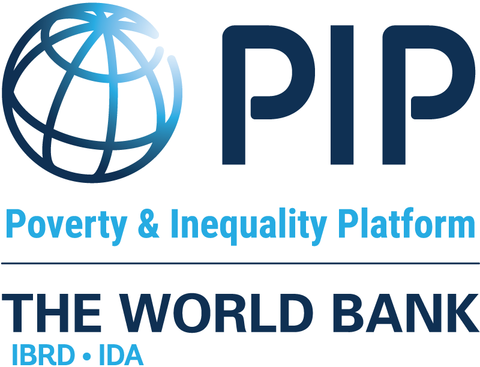

```{=html}
<style type="text/css">
h1 { /* Header 1 */
  font-size: 24px;
}
h2 { /* Header 2 */
    font-size: 18px;
}
h3 { /* Header 3 */
    font-size: 14px;
}
body {
text-align: justify}

</style>
```
```{r setup, include=FALSE}
knitr::opts_chunk$set(echo = TRUE) 
```

# Introduction {.unnumbered}

```{r pip-logo, out.width='30%', fig.align='center', echo=FALSE, include=identical(knitr:::pandoc_to(), 'html'), fig.link='https://pip.worldbank.org/', fig.show='hold',  out.extra='style="float:right; padding:10px"'}

```

This site describes the methodology implemented by the World Bank to
calculate global and regional poverty rates that are officially reported
in the [Poverty and Inequality Platform](https://pip.worldbank.org/home)
(PIP). The next page summarizes the methodology in non-technical terms
using five steps. The summary is followed by five chapters that dig into
these steps in detail.

All decisions, assumptions, and protocols involved in these steps and in
the chapters that follow are governed by the World Bank's Global Poverty
Working Group, which is composed of staff from the Poverty and Equity
Global Practice, the Development Data Group, and the Development
Research Group.

Please cite the handbook as follows: World Bank. 2025. "Poverty and
Inequality Platform Methodology Handbook." Edition 2025-06. Available at
<https://datanalytics.worldbank.org/PIP-Methodology/>.
